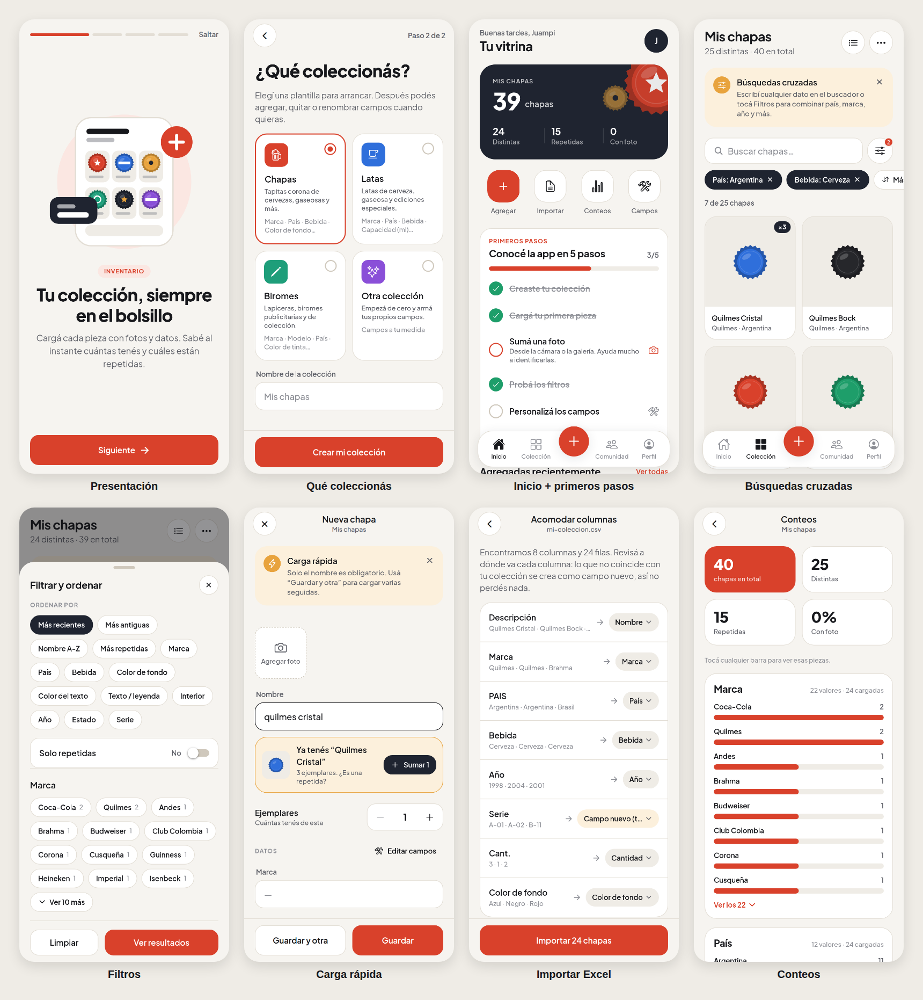

# Vitrina — Colección de Chapas

App de celular para coleccionistas: tener la colección inventariada, contada y ordenada, y más adelante conectar con otros coleccionistas.

> "Vitrina" es un nombre provisorio. Se cambia en `app.json` (`name`) y en los textos de la app.



## Estado actual: etapa 1 (inventario)

Ya funciona, guardando todo en el teléfono:

- **Onboarding completo:** presentación de 4 pantallas con ilustraciones propias, configuración inicial (tu nombre y qué coleccionás) y una guía de primeros pasos en la pantalla de inicio que lleva a probar cada función. Además, cada pantalla muestra un consejo la primera vez que se entra. La presentación se puede volver a ver desde Perfil.
- **Colecciones a medida:** plantillas para chapas, latas, biromes o una colección desde cero. Los campos se pueden agregar, quitar, renombrar y reordenar, con 4 tipos de dato: texto, lista de opciones, número y sí/no.
- **Inventario con fotos:** carga rápida desde la cámara o la galería, con “Guardar y otra” para cargar varias seguidas. Los campos de texto sugieren los valores que ya usaste (así no aparecen "Argentina" y "argentina" como si fueran distintos).
- **Conteo y repetidas:** cada pieza tiene su cantidad de ejemplares. Si cargás una que ya tenés, la app te avisa y te ofrece sumarla como repetida.
- **Búsquedas cruzadas:** un buscador que busca en todos los datos, sin importar tildes ni mayúsculas, más filtros que se combinan entre sí (país + bebida + rango de años + solo repetidas). Se puede ordenar por cualquier campo y ver la colección en grilla o en lista.
- **Conteos:** totales, distintas, repetidas y porcentaje con foto, más barras por cada campo. Tocando una barra se abre la colección filtrada.
- **Excel, al estilo Banco Roela:**
  - Planilla modelo `.xlsx` con las columnas de tu colección, listas desplegables y una hoja de instrucciones.
  - Importación de cualquier Excel o CSV: detecta encabezados aunque haya títulos arriba, acomoda cada columna con el campo que corresponde y crea campos nuevos para las columnas que no coinciden, así no se pierde nada. Antes de importar muestra cómo va a quedar.
  - Exportación de la colección entera a Excel.
- **Diseño:** sistema de diseño propio (colores, tipografía Plus Jakarta Sans, componentes), modo claro y oscuro, ícono propio y chapitas dibujadas en vectores que toman el color cargado cuando la pieza no tiene foto.
- **Comunidad:** una pestaña que adelanta lo que trae la etapa 2.

## Cómo probarla

Hace falta [Node.js](https://nodejs.org) 20 o más nuevo.

```bash
npm install
npx expo start
```

- **En el celular:** instalá **Expo Go** (App Store o Google Play) y escaneá el código QR que aparece en la terminal. La compu y el celular tienen que estar en la misma red wifi.
- **En la compu:** apretá `w` en la terminal para abrirla en el navegador. En la web las fotos se guardan dentro del navegador; está pensada para mostrarla, no para usarla todos los días.

### Publicarla en Vercel

El repo ya trae `vercel.json`: Vercel compila la versión web (`npx expo export --platform web`) y la publica desde `dist/`.

1. Entrá a [vercel.com/new](https://vercel.com/new) con tu cuenta de GitHub.
2. Importá el repositorio `colecci-n-de-chapas` y tocá **Deploy** sin cambiar nada.
3. Cada vez que se suba un cambio al repo, Vercel publica la versión nueva sola.

Para probar la importación hay un ejemplo en [`docs/ejemplo-coleccion.csv`](docs/ejemplo-coleccion.csv).

Chequeos para desarrollar:

```bash
npm test            # tests de búsqueda, conteos e importación/exportación de Excel
npm run typecheck
npm run lint
```

## Cómo está hecha

- **React Native + Expo (SDK 57)** con Expo Router: un solo código para Android, iPhone y web.
- **Zustand + AsyncStorage** para guardar los datos en el dispositivo. Las fotos se copian a la carpeta de la app.
- **Excel sin librerías pesadas:** la planilla se genera con un escritor `.xlsx` propio (`src/lib/excel/xlsx-writer.ts`) y se lee con `read-excel-file`.

```
src/
  app/              pantallas (cada archivo es una ruta)
    (tabs)/         Inicio, Colección, Comunidad, Perfil
    onboarding.tsx  presentación + configuración inicial
    item/           cargar, editar y ver una pieza
    collections/    nueva colección, editar campos, importar, conteos
  components/       componentes de la app y sistema de diseño (ui/)
  domain/           modelo de datos, plantillas, búsqueda y conteos
  lib/excel/        leer, mapear y generar planillas
  store/            estado y guardado local
  theme/            colores, tipografía y espaciados
```

## Próximos pasos

1. **Sincronización online (cierra la etapa 1):** usar Supabase para cuentas de usuario, base de datos y fotos en la nube, y así tener la colección en cualquier dispositivo. Para conectarla hace falta crear una cuenta gratuita en [supabase.com](https://supabase.com) y pasar las claves del proyecto.
2. **Etapa 2, comunidad:** perfiles públicos, publicar repetidas, intercambios, compra y venta, reputación y ranking, y catálogo compartido.
3. **Etapa 3, garantías y pagos:** por ejemplo con MercadoPago.

## Pendiente de definir

- [ ] **El Visual Basic actual:** ¿es un Excel con macros o una base de Access? Sirve para ajustar la plantilla de chapas y probar una importación real.
- [ ] **Sin conexión:** ¿hay que poder cargar sin señal (por ejemplo, en una feria de canje)? Hoy funciona así; hay que decidir si se mantiene al pasar a online.
- [ ] **Catálogo compartido:** ¿una biblioteca pública donde cada pieza figura una sola vez y cada coleccionista marca "la tengo"?
- [ ] **Compra y venta:** ¿alcanza con contactar y calificar, o los pagos tienen que hacerse dentro de la app?
- [ ] **Nombre definitivo de la app** e idioma (¿solo español al principio?).
